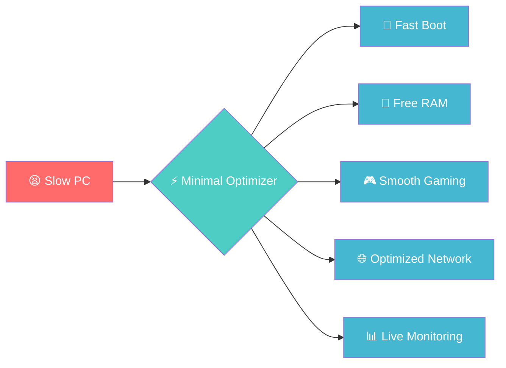
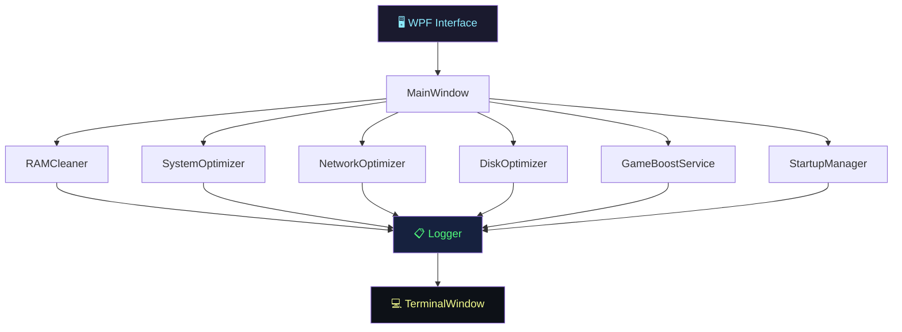

<div align="center">

<!-- ═══════════════════════════════════════════════════════════
     ANIMATED BANNER
     ═══════════════════════════════════════════════════════════ -->


<!-- Animated Typing -->
<a href="https://git.io/typing-svg">
  
</a>

<br/>

<!-- ═══════════════════════════════════════════════════════════
     BADGES
     ═══════════════════════════════════════════════════════════ -->
<p>
  <a href="https://github.com/aMathyzinn/Minimal-Optimizer-2/releases/latest">
    
  </a>
  <a href="https://github.com/aMathyzinn/Minimal-Optimizer-2/blob/main/LICENCE.txt">
    
  </a>
  <a href="https://dotnet.microsoft.com/download/dotnet/8.0">
    
  </a>
  <a href="#">
    
  </a>
</p>

<p>
  <a href="https://github.com/aMathyzinn/Minimal-Optimizer-2/stargazers">
    
  </a>
  &nbsp;
  <a href="https://github.com/aMathyzinn/Minimal-Optimizer-2/network/members">
    
  </a>
  &nbsp;
  <a href="https://github.com/aMathyzinn/Minimal-Optimizer-2/issues">
    
  </a>
  &nbsp;
  <a href="https://github.com/aMathyzinn/Minimal-Optimizer-2/commits/main">
    
  </a>
</p>

<br/>


</div>

---

<!-- ═══════════════════════════════════════════════════════════
     DEMO / SCREENSHOT
     ═══════════════════════════════════════════════════════════ -->
<div align="center">

## 📸 Interface

<!-- Hero screenshot -->


<br/><br/>

<!-- Screenshot grid -->
<table>
  <tr>
    <td align="center">
      <br/>
      <sub><b>🏠 Main Screen</b></sub>
    </td>
    <td align="center">
      <br/>
      <sub><b>⚙️ Optimization Panel</b></sub>
    </td>
  </tr>
  <tr>
    <td align="center">
      <br/>
      <sub><b>🚀 Startup Manager</b></sub>
    </td>
    <td align="center">
      <br/>
      <sub><b>💻 Diagnostic Terminal</b></sub>
    </td>
  </tr>
</table>

</div>

---

<!-- ═══════════════════════════════════════════════════════════
     TABLE OF CONTENTS
     ═══════════════════════════════════════════════════════════ -->
<details>
<summary><b>📋 Table of Contents</b></summary>

- [✨ Features](#-features)
- [🔥 Why Minimal Optimizer?](#-why-minimal-optimizer)
- [🚀 Quick Start](#-quick-start)
- [📦 Installation](#-installation)
- [💻 How to Use](#-how-to-use)
- [🏗️ Architecture](#️-architecture)
- [🛠️ Build from Source](#️-build-from-source)
- [📋 Requirements](#-requirements)
- [🌍 Languages](#-languages)
- [🤝 Contributing](#-contributing)
- [🔒 Security](#-security)
- [📜 License](#-license)
- [👨‍💻 Author](#-author)

</details>

---

<!-- ═══════════════════════════════════════════════════════════
     FEATURES
     ═══════════════════════════════════════════════════════════ -->
## ✨ Features

<div align="center">

<table>
  <tr>
    <td align="center" width="20%">
      <br/>
      <b>RAM Cleaner</b><br/>
      <sub>Free up memory with smart cache algorithms</sub>
    </td>
    <td align="center" width="20%">
      <br/>
      <b>Service Optimizer</b><br/>
      <sub>Safely manage Windows services</sub>
    </td>
    <td align="center" width="20%">
      <br/>
      <b>Monitoring</b><br/>
      <sub>Real-time CPU, RAM & Disk usage</sub>
    </td>
    <td align="center" width="20%">
      <br/>
      <b>Startup Manager</b><br/>
      <sub>Control boot programs efficiently</sub>
    </td>
    <td align="center" width="20%">
      <br/>
      <b>Game Boost</b><br/>
      <sub>Dedicate resources to your game</sub>
    </td>
  </tr>
  <tr>
    <td align="center" width="20%">
      <br/>
      <b>Network</b><br/>
      <sub>Optimize latency and TCP/IP connection</sub>
    </td>
    <td align="center" width="20%">
      <br/>
      <b>Disk</b><br/>
      <sub>Clean temp files and system junk</sub>
    </td>
    <td align="center" width="20%">
      <br/>
      <b>Rollback</b><br/>
      <sub>Undo any change with 1 click</sub>
    </td>
    <td align="center" width="20%">
      <br/>
      <b>Portable</b><br/>
      <sub>Run directly from USB, no install needed</sub>
    </td>
    <td align="center" width="20%">
      <br/>
      <b>Multi-language</b><br/>
      <sub>English & Portuguese built-in</sub>
    </td>
  </tr>
</table>

</div>

<br/>

```
✅ Smart RAM and system cache cleaning
✅ Safe Windows service management
✅ Real-time monitoring (CPU · RAM · Disk)
✅ Startup program manager
✅ Game Boost Mode — dedicated resources for gaming
✅ Network optimization (TCP/IP, latency, ports)
✅ Disk cleanup and temporary file removal
✅ Rollback system — undo any change
✅ Portable mode — no installation, run from USB
✅ UI available in EN-US and PT-BR
✅ Integrated diagnostic terminal
✅ 100% Open Source · GPL-3.0
```

---

<!-- ═══════════════════════════════════════════════════════════
     WHY
     ═══════════════════════════════════════════════════════════ -->
## 🔥 Why Minimal Optimizer?

<div align="center">

| | Other Optimizers | ✅ Minimal Optimizer 2.0 |
|:---:|:---|:---|
| 💸 | Full of ads and paywalls | **100% free and open source** |
| 🔮 | Change things without transparency | **Full log of every action** |
| 💣 | No way to revert changes | **1-click rollback** |
| 🐘 | Heavy and slow | **~5 MB, ultra-lightweight** |
| 🧩 | Complex interfaces | **Minimalist & intuitive UI** |
| 🦕 | Outdated technology | **C# .NET 8.0 + modern WPF** |
| 🌐 | English only | **EN-US and PT-BR** |

</div>

<br/>

<div align="center">



</div>

---

<!-- ═══════════════════════════════════════════════════════════
     QUICK START
     ═══════════════════════════════════════════════════════════ -->
## 🚀 Quick Start

### ⚡ Option 1 — Direct download (recommended)

<div align="center">

[](https://github.com/aMathyzinn/Minimal-Optimizer-2/releases/latest)

</div>

1. Download the `.zip` or `.exe` from the [Releases page](https://github.com/aMathyzinn/Minimal-Optimizer-2/releases/latest)
2. Extract (if needed) and run `MinimalOptimizer2.exe`
3. **Run as Administrator** to access all features

### 🔧 Option 2 — Build from source

```bash
git clone https://github.com/aMathyzinn/Minimal-Optimizer-2.git
cd Minimal-Optimizer-2
dotnet build -c Release
```

---

<!-- ═══════════════════════════════════════════════════════════
     INSTALLATION
     ═══════════════════════════════════════════════════════════ -->
## 📦 Installation

### Available distribution types

| Type | File | Description |
|------|------|-------------|
| 🗜️ **Portable** | `MinimalOptimizer2-Portable.zip` | Extract and run — no install needed |
| 📦 **Self-contained** | `MinimalOptimizer2-SelfContained.exe` | Includes the .NET Runtime |
| 🪟 **Installer** | `MinimalOptimizer2-Setup.exe` | Traditional Windows installer |

> **⚠️ Note:** Some system optimizations require the program to be run as **Administrator**.

---

<!-- ═══════════════════════════════════════════════════════════
     USAGE
     ═══════════════════════════════════════════════════════════ -->
## 💻 How to Use

<details>
<summary><b>🧹 RAM Cleaning</b></summary>

1. Open Minimal Optimizer as Administrator
2. On the main screen, click **"Clean RAM"**
3. Watch the freed memory in real-time on the dashboard

</details>

<details>
<summary><b>⚙️ System Optimization</b></summary>

1. Open the **Optimizations** panel
2. Select the modules you want (Network, Services, Disk...)
3. Review the listed changes before applying
4. Click **"Apply"** — a full log will be generated
5. Use **"Rollback"** at any time to undo

</details>

<details>
<summary><b>🎮 Game Boost Mode</b></summary>

1. Click **"Game Mode"** on the main screen
2. Launch your favorite game
3. The system will prioritize resources for the focused application
4. Disable after gaming to restore default behavior

</details>

<details>
<summary><b>🚀 Startup Manager</b></summary>

1. Go to the **"Startup"** tab
2. See all programs that launch with Windows
3. Disable the unnecessary ones
4. Restart your PC for a faster boot

</details>

---

<!-- ═══════════════════════════════════════════════════════════
     ARCHITECTURE
     ═══════════════════════════════════════════════════════════ -->
## 🏗️ Architecture

```
MinimalOptimizer2/
├── 📂 Models/              # Data models (OptimizationItem, StartupEntry)
├── 📂 Services/            # Business logic
│   ├── RAMCleaner.cs       # Memory cleaning
│   ├── SystemOptimizer.cs  # Windows optimizations
│   ├── NetworkOptimizer.cs # TCP/IP network optimization
│   ├── DiskOptimizer.cs    # Disk cleanup
│   ├── GameBoostService.cs # Performance mode for gaming
│   ├── StartupManager.cs   # Startup control
│   ├── RAMDiagnostics.cs   # Memory monitoring
│   └── Logger.cs           # Structured log system
├── 📂 Views/               # WPF interfaces
│   ├── MainWindow.xaml     # Main window
│   ├── TerminalWindow.xaml # Diagnostic terminal
│   └── StartupManagerWindow.xaml
├── 📂 Resources/           # Localization strings (PT-BR / EN-US)
├── 📂 Utils/               # Utilities and helpers
└── App.xaml                # Application entry point
```

<div align="center">



</div>

---

<!-- ═══════════════════════════════════════════════════════════
     BUILD FROM SOURCE
     ═══════════════════════════════════════════════════════════ -->
## 🛠️ Build from Source

### Prerequisites

- [.NET 8.0 SDK](https://dotnet.microsoft.com/download/dotnet/8.0) or higher
- Windows 10 / 11
- Visual Studio 2022+ or VS Code with the C# extension

### Standard build

```bash
git clone https://github.com/aMathyzinn/Minimal-Optimizer-2.git
cd Minimal-Optimizer-2

# Debug
dotnet build

# Release
dotnet build -c Release
```

### Publish distributable versions

```bash
# Portable version (requires .NET installed on the machine)
dotnet publish -c Release -r win-x64

# Self-contained version (includes the runtime)
dotnet publish -c Release -r win-x64 --self-contained true

# Single file (everything in one .exe)
dotnet publish -c Release -r win-x64 --self-contained true `
  -p:PublishSingleFile=true `
  -p:IncludeAllContentForSelfExtract=true
```

> Final binaries will be at `bin/Release/net8.0-windows/win-x64/publish/`

---

<!-- ═══════════════════════════════════════════════════════════
     REQUIREMENTS
     ═══════════════════════════════════════════════════════════ -->
## 📋 Requirements

<div align="center">

| Component | Minimum | Recommended |
|:---:|:---|:---|
| 🪟 **OS** | Windows 10 (1809+) | Windows 11 22H2+ |
| ⚙️ **Runtime** | .NET 8.0 Runtime | .NET 8.0 SDK |
| 💾 **RAM** | 512 MB free | 1 GB+ free |
| 💿 **Disk** | 15 MB | 50 MB |
| 🔑 **Privileges** | Administrator | Administrator |

</div>

---

<!-- ═══════════════════════════════════════════════════════════
     LANGUAGES
     ═══════════════════════════════════════════════════════════ -->
## 🌍 Languages

<div align="center">

| Language | Status |
|:---:|:---:|
| 🇺🇸 English (US) | ✅ Complete |
| 🇧🇷 Portuguese (Brazil) | ✅ Complete |

</div>

Translation contributions are welcome! See the files at `Resources/Strings.*.xaml`.

---

<!-- ═══════════════════════════════════════════════════════════
     CONTRIBUTING
     ═══════════════════════════════════════════════════════════ -->
## 🤝 Contributing

Contributions are very welcome! Follow the steps below:

```bash
# 1. Fork the repository
# 2. Create a branch for your feature
git checkout -b feature/my-feature

# 3. Commit your changes
git commit -m "feat: add new feature X"

# 4. Push to your branch
git push origin feature/my-feature

# 5. Open a Pull Request
```

### What to contribute?

- 🐛 **Bug fixes** — found a problem? Open an issue or PR directly
- ✨ **New features** — discuss in an issue before implementing
- 🌍 **Translations** — add support for new languages
- 📖 **Documentation** — improvements are always welcome
- 🧪 **Tests** — test coverage is always useful

<div align="center">

[](https://github.com/aMathyzinn/Minimal-Optimizer-2/issues)
[](https://github.com/aMathyzinn/Minimal-Optimizer-2/pulls)

</div>

---

<!-- ═══════════════════════════════════════════════════════════
     SECURITY
     ═══════════════════════════════════════════════════════════ -->
## 🔒 Security

- All critical operations create a **prior backup** when applicable
- The **diagnostic terminal** shows exactly what was changed
- Network operations do not drop the user's connection
- DNS changes are **never made automatically**
- Always use the latest version from the [Releases page](https://github.com/aMathyzinn/Minimal-Optimizer-2/releases)

> Found a vulnerability? Open a [private issue](https://github.com/aMathyzinn/Minimal-Optimizer-2/security) or contact directly.

---

<!-- ═══════════════════════════════════════════════════════════
     LICENSE
     ═══════════════════════════════════════════════════════════ -->
## 📜 License

<div align="center">

This project is licensed under the **GNU General Public License v3.0**.

[](https://www.gnu.org/licenses/gpl-3.0)

You are free to use, modify and distribute this software,
as long as you keep the same license and the original author's credits.

See the [LICENCE.txt](LICENCE.txt) file for full details.

</div>

---

<!-- ═══════════════════════════════════════════════════════════
     AUTHOR
     ═══════════════════════════════════════════════════════════ -->
## 👨‍💻 Author

<div align="center">

<br/>

**aMathyzinn**

[](https://github.com/aMathyzinn)

*Developer passionate about performance, clean UI and code that makes a difference.*

</div>

---

<!-- ═══════════════════════════════════════════════════════════
     SUPPORT / STAR
     ═══════════════════════════════════════════════════════════ -->
<div align="center">

### ⭐ Enjoying the project?

If Minimal Optimizer was useful to you, drop a **star** on the repository!
It helps the project grow and motivates new improvements.

[](https://github.com/aMathyzinn/Minimal-Optimizer-2)
[](https://github.com/aMathyzinn/Minimal-Optimizer-2/releases/latest)
[](https://github.com/aMathyzinn/Minimal-Optimizer-2/issues/new)

</div>

---

<!-- ═══════════════════════════════════════════════════════════
     FOOTER
     ═══════════════════════════════════════════════════════════ -->
<div align="center">


<sub>
  Made with ❤️ by <a href="https://github.com/aMathyzinn"><b>aMathyzinn</b></a> · 
  <a href="LICENCE.txt">GPL-3.0</a> · 
  <a href="https://github.com/aMathyzinn/Minimal-Optimizer-2/releases">Releases</a> · 
  <a href="https://github.com/aMathyzinn/Minimal-Optimizer-2/issues">Issues</a>
</sub>

</div>
